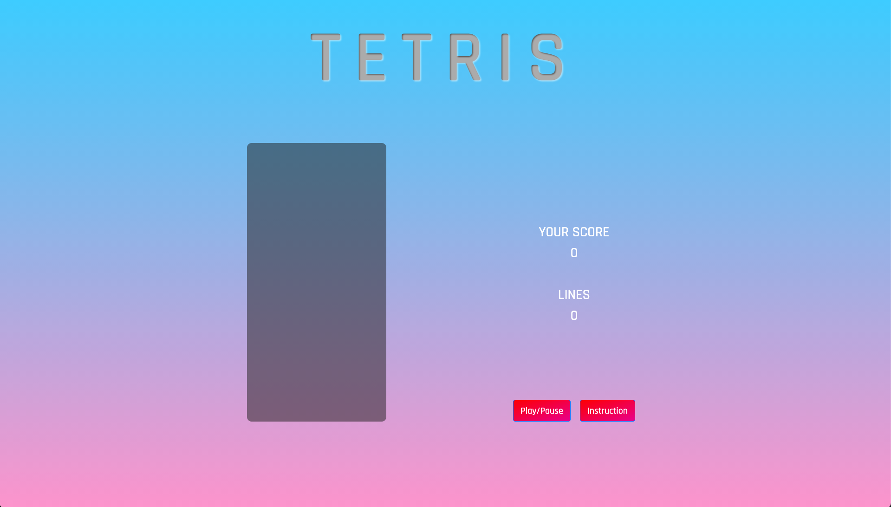
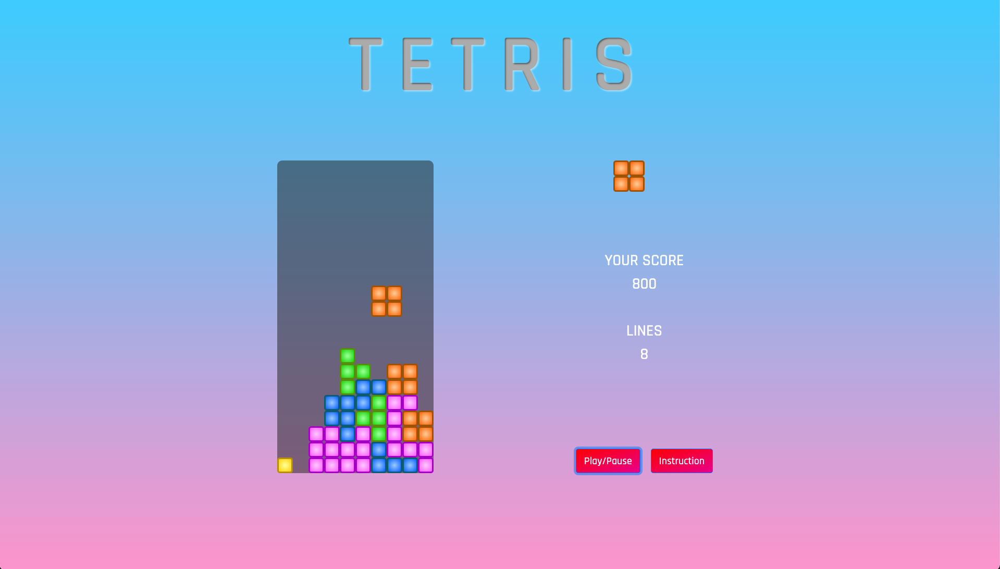
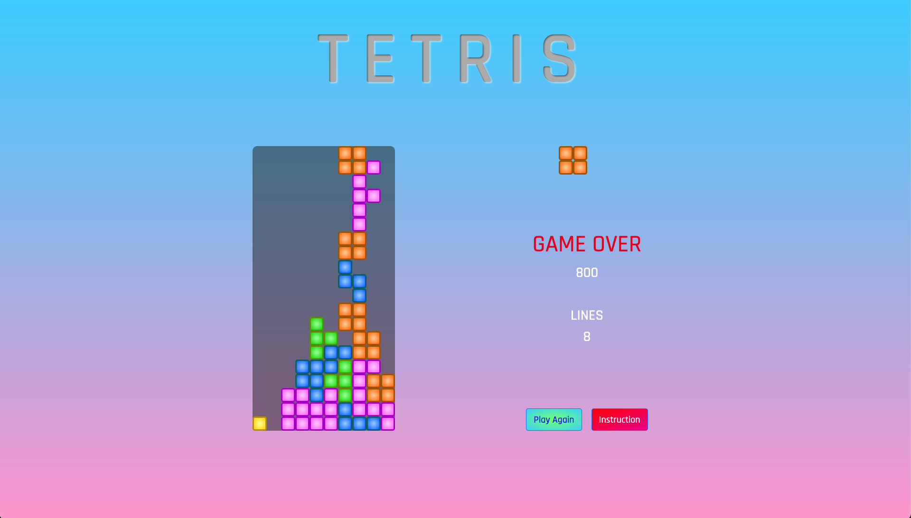
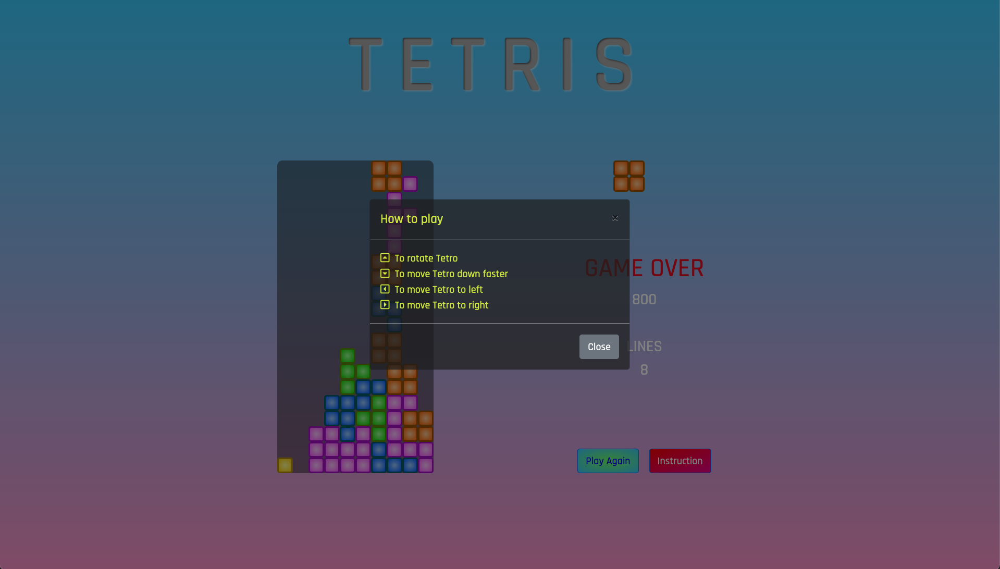

# SEI-FLEX-38 PROJECT - 1

# TETRIS - BROWSER BASED GAME  🎮 🎲

#### This is classic Tetris game. It is the addictive puzzle game embracing our universal desire to create order out of chaos....  The goal of Tetris is to score as many points as possible by clearing horizontal lines of Blocks.  *Possiblity* *of* *some* *twists* *comming* *in* *near* *future*...🙊
***
*   Game Play : [Click here](https://ar021.github.io/Tetris/)
*   Technologies used : HTML,CSS,JavaScript,Bootstrap
*   Game Play Screenshots :

***
## Challenges Faced 
* Figuring out the fundamentals of the game in terms of programming
* Writing function which prevent tetro from moving out of the game board while rotating near the edge
* Writing Scoring Row function
* Some big fixes - solution was very simple ( without writing a single code ) but journey to identify the problem consummed some sleeps 
***
## Key Learings
* On the game praposal day, we were shown some games built by alumini and it was beyond my imagination that i could achive something like that. *My Tetris* is not there yet but i've broken the barrier.
* How to bring together all the piece i have learnt during our class
* How to break down the problem and how to work towards the solution
* How to google *stuff* and mold into your own code
***
## Future Goals
* To show preview of upcoming Tetro
* Added dificulty levels and some bonus
* Add music, animation, css etc

